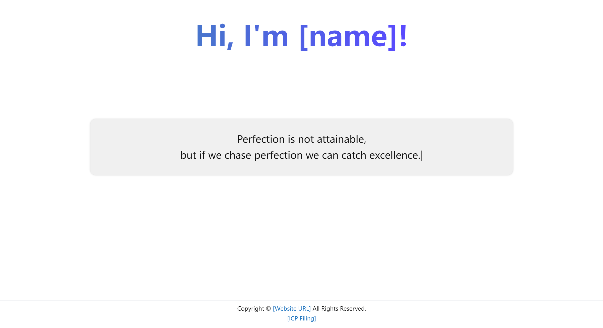

# bypage

> This is a simple homepage used to display some information.

Replace some necessary information and delete some unnecessary information.

## Usage

Run on a web server or development tool web server plugin.

## Browser support

- Latest Chrome
- Latest Firefox
- Latest Safari
